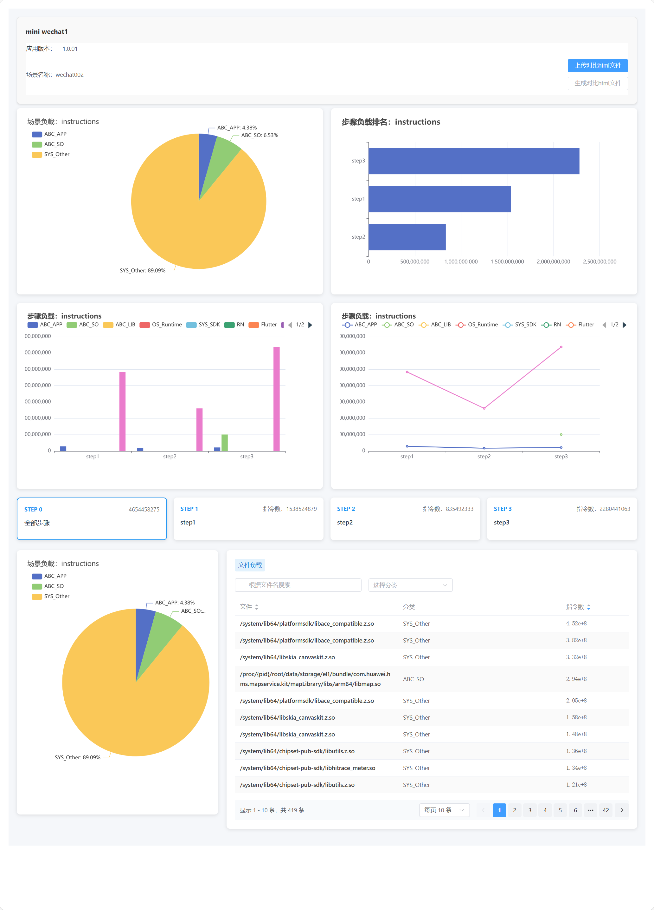
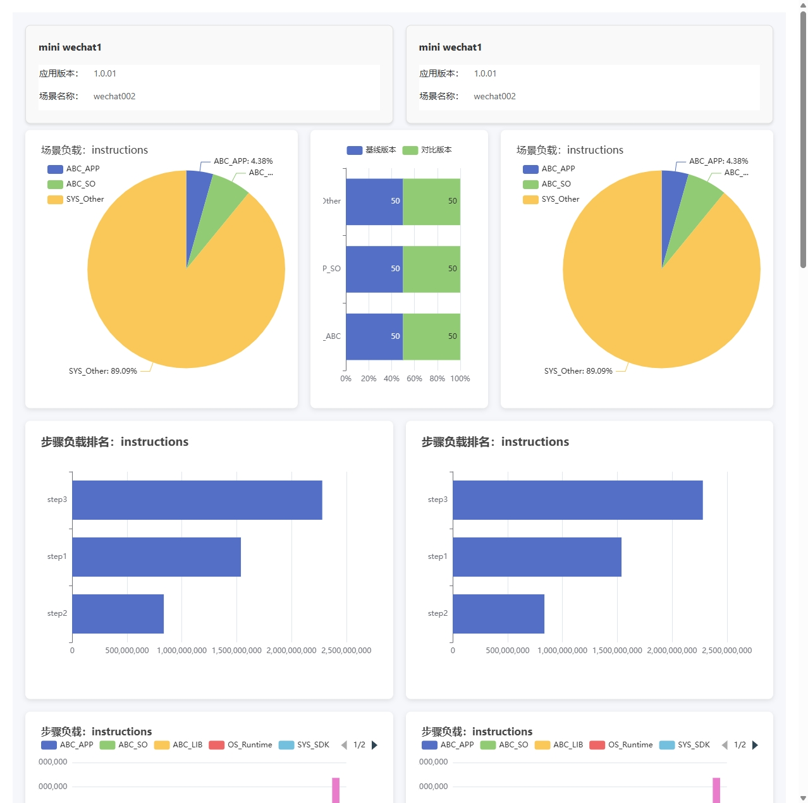
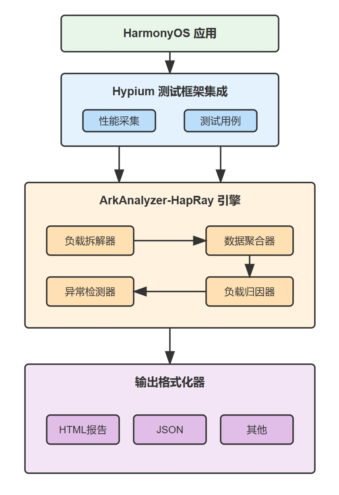

# 鸿蒙应用负载分析工具 ArkAnalyzer-HapRay

## 📋 概述

ArkAnalyzer-HapRay是专为鸿蒙应用开发者设计的负载分析工具，帮助开发团队解决应用运行中的常见高负载问题：

- 🔥 **设备发热** - 定位导致CPU持续高负载的代码段
- 🔋 **功耗过高** - 识别大量指令执行导致的电池消耗
- ⚡ **应用卡顿** - 发现指令数异常导致的处理延迟
- 📊 **系统调度** - 分析指令执行对系统调度的影响

通过数据驱动的动态测试和细粒度分析，ArkAnalyzer-HapRay帮助开发团队基于真实数据识别、定位和优化这些问题，提升用户体验。分析结果基于实际运行数据，确保优化方案的科学性和可量化。

**核心优势:**

- 🔍 **精准定位** - 将负载归因到具体模块、页面、文件和函数
- 📊 **多维分析** - 支持全局和细粒度分析，全面把握应用状态
- 🔄 **版本对比** - 追踪不同版本间的负载变化趋势
- 📈 **数据驱动** - 基于真实数据优化，确保效果可量化
- 🌟 **开源共建** - 支持社区定制和扩展

## 🔥 负载分析说明

负载分析是评估应用资源使用情况的关键方法。ArkAnalyzer-HapRay目前主要通过指令数进行分析。

### 为什么选择指令数作为核心指标？

CPU指令数被选为核心指标，主要基于以下原因：

- **直接关联用户体验** - 影响设备发热、功耗和应用流畅度
- **精确度高** - 比CPU使用率更精确，能定位到具体代码段
- **易于归因** - 可追踪到函数、模块和页面级别
- **跨设备一致性** - 不同设备间具有较好的可比性
- **可预测性强** - 指令数异常通常是性能问题的前兆

与传统的CPU占用率和内存分析相比，指令数分析能更早发现性能问题，并提供更精准的优化方向。

### 指令数分析能力

- 精确统计CPU执行的指令数量
- 识别指令数异常高的代码段
- 定位不必要的计算和循环
- 关联到用户体验问题（发热、功耗、卡顿、系统调度）

通过负载分析，开发团队可以：
- 及早发现潜在性能问题
- 优化关键路径代码
- 提升应用响应速度
- 延长设备续航时间
- 减轻设备发热问题

未来我们将扩展更多负载分析指标，包括：
- CPU周期数分析
- 大小核心使用占比
- MCU使用情况
- 其他性能指标

## 📊 可视化报告预览

ArkAnalyzer-HapRay提供直观的可视化分析报告，帮助开发者快速定位性能问题：


报告主要包含以下核心视图：

1. **全局负载分布** - 展示应用整体负载情况
2. **模块负载排行** - 按负载大小排序的模块列表
3. **热点函数分析** - 高负载函数详细分析
4. **调用链追踪** - 函数调用关系可视化
5. **版本对比** - 历史版本性能对比

## 📈 主要功能

### 当前功能

1. **多维度负载分析**
   - 模块级分析
   - 页面级分析
   - 文件级分析
   - 函数级分析
   - 领域归属分析

2. **灵活测试场景分析**
   - 按测试场景分解负载
   - 按操作步骤分解负载
   - 自定义测试场景
   - 多场景对比分析

3. **丰富输出格式**
   - HTML分析报告
   - JSON格式数据
   - CI/CD集成支持

### 计划功能

- 数据库集成存储
- 函数调用链分析
- 实时数据监控
- 自定义仪表盘
- IDE插件支持
- 交互式分析模块

## 🔍 实际案例

### 地图应用渲染优化

**问题:**
地图应用在滑动和缩放时严重卡顿，电池消耗快。

**分析过程:**
1. 按操作采集指令数据
2. 发现地图渲染逻辑过于频繁
3. 定位到坐标计算和图层处理问题

**优化方案:**
1. 减少渲染频率，实现节流
2. 优化坐标计算算法
3. 实现图层按需加载

**效果:**
- 滑动流畅度提升60%
- 耗电量减少45%
- 用户平均使用时长增加25%

## 📈 版本对比分析

ArkAnalyzer-HapRay支持多版本间的负载对比分析，帮助团队追踪性能变化：


通过版本对比，您可以：
1. 识别性能退化点
2. 验证优化效果
3. 建立性能基准
4. 跟踪长期趋势

## 🔧 技术架构

### 核心组件

1. **数据采集层**
   - Hypium测试框架集成
   - CPU指令数据采集
   - 性能日志记录

2. **分析引擎**
   - 负载拆解算法
   - 多维度数据聚合
   - 异常检测分析

3. **报告生成器**
   - 可视化图表
   - 多格式报告输出
   - 优化建议生成

### 系统架构图



## 📋 负载优化指南

### 应用性能优化决策流程

```
┌────────────┐     ┌────────────┐     ┌────────────┐
│ 收集负载数据│────→│ 识别热点问题│────→│ 分类问题类型│
└────────────┘     └────────────┘     └──────┬─────┘
                                             │
┌────────────┐     ┌────────────┐     ┌──────↓─────┐
│ 评估优化效果│←────│ 实施优化方案│←────│ 确定优化方向│
└────────────┘     └────────────┘     └────────────┘
```

## 📊 负载指标说明

| 指标名称 | 说明 | 优化方向 | 合理范围 |
|---------|------|---------|---------|
| 指令数 | CPU执行的指令数量 | 优化算法，减少计算 | 分场景 |
| 热点函数 | 执行指令数最多的函数 | 重构算法，缓存结果 | <10%总指令数 |
| 组件指令数 | 各组件执行的指令数量 | 优化组件实现 | <100万/组件 |

## 🚀 快速开始

> **温馨提示**：ArkAnalyzer-HapRay目前仍处于积极开发阶段，在部署或使用过程中可能遇到一些问题。我们的工程师团队提供专业技术支持，如有任何部署问题，请随时联系我们。

### 环境准备

- HarmonyOS开发环境 (DevEco Studio 3.0+)
- Hypium测试框架 (1.0.0+)
- TypeScript 4.5+

### 安装方式

#### 方式一：Docker（推荐）

为降低环境依赖和部署复杂度，我们提供了Docker镜像：

```bash
# 克隆仓库
git clone https://github.com/SMAT-Lab/ArkAnalyzer-HapRay.git
cd ArkAnalyzer-HapRay/docker

# 构建Docker镜像
./build.sh

# 运行Docker容器
docker run --rm -it --privileged hapray bash
```

详细Docker配置请参考[Docker目录](https://github.com/SMAT-Lab/ArkAnalyzer-HapRay/tree/main/docker)。

#### 方式二：常规安装

```bash
# 克隆仓库
git clone https://github.com/SMAT-Lab/ArkAnalyzer-HapRay.git
cd ArkAnalyzer-HapRay

# 安装依赖
npm install

# 构建项目
npm run build
```

**依赖说明:**
```json
{
  "dependencies": {
    "@types/node": "^16.0.0",
    "typescript": "^4.5.0",
    "@ohos/hypium": "^1.0.0",
    "@ohos/hvigor": "^1.0.0"
  }
}
```

> **注意**：如遇到依赖项版本兼容性问题，请联系我们的技术支持团队获取帮助。

## 📊 使用流程

### 1. 准备阶段

- **配置测试环境** - 安装依赖和工具
- **准备测试用例** - 编写Hypium测试用例，覆盖关键场景
- **设置分析参数** - 配置负载归因规则和分析粒度


### 2. 执行阶段

- **运行测试** - 执行Hypium测试并生成trace文件
- **采集数据** - 收集CPU指令数据和其他性能指标
- **执行分析** - 运行负载分析工具处理采集数据

### 3. 分析阶段

- **查看报告** - 分析生成的HTML报告
- **识别问题** - 定位高负载模块和潜在优化点
- **制定方案** - 根据分析结果确定优化方向

> **实施建议**：首次使用工具时，我们建议与我们的工程师团队保持联系，我们很乐意提供技术指导，确保您能顺利开展分析工作并获得有价值的结果。请联系对接的工程师获取支持。

## ❓ 常见问题

1. **如何解读分析报告?**  
   分析报告按负载从高到低排序，重点关注红色标记的高负载模块和异常点。

2. **如何优化高负载模块?**  
   先分析模块具体负载来源，再结合代码审查确定优化方案，常见方案包括算法优化、资源使用优化和架构改进。

3. **支持哪些输出格式?**  
   当前支持HTML、JSON格式输出，未来将支持数据库输出和PDF报告。

4. **支持多用户协作分析吗?**  
   当前版本暂不支持多用户协作，但可以通过共享分析报告实现团队协作。

5. **如何识别代码中的内存泄漏?**  
   目前工具主要关注CPU负载，不直接分析内存泄漏，建议结合其他内存分析工具使用。

6. **分析结果会影响实际应用性能吗?**  
   分析过程在测试环境进行，不会影响生产环境性能，但测试过程中采集数据会略有性能影响。

7. **部署或使用过程中遇到问题怎么办?**  
   作为一个正在发展中的工具，可能会遇到一些环境兼容性或配置问题。我们的工程师团队提供全程技术支持，请通过以下方式联系我们:
   - 联系和您对接的工程师
   - 在GitHub仓库提交Issue

## 🌟 功能建议与社区

我们致力于持续改进ArkAnalyzer-HapRay，使其更好地服务于鸿蒙应用开发者。如果您有：

- 新功能建议
- 使用体验反馈
- 性能优化经验
- 实际应用案例

欢迎通过以下方式与我们分享：

1. 提交功能建议
2. 分享优化经验
3. 提供使用反馈
4. 参与社区讨论

您的每一条建议都将帮助我们打造更好的工具，让更多开发者受益。

## 📄 许可证

Apache License 2.0

_[返回顶部](#鸿蒙应用负载分析工具-arkanalyzer-hapray)_ 