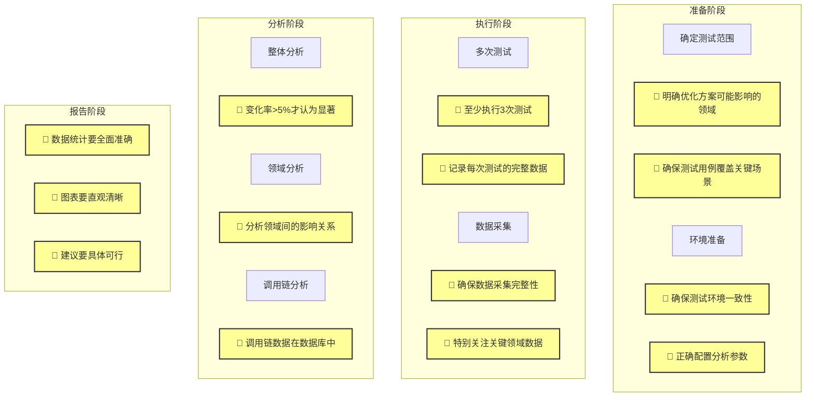

# 收益测试分析指南

## 📋 概述

收益测试分析是评估优化方案效果的关键环节。本文档旨在向测试人员说明如何通过ArkAnalyzer-HapRay工具，科学地评估优化方案带来的性能提升。

## 🔄 测试分析流程图



## 🔍 测试分析流程

### 1. 测试准备

#### 1.1 确定测试范围
- 明确优化方案可能影响的领域、模块和函数
- 识别可能受影响的调用链和依赖关系
- 准备测试用例，覆盖关键场景

#### 1.2 环境准备
- 准备优化前后的两个版本
- 确保使用相同的测试环境和数据
- 配置ArkAnalyzer-HapRay分析参数

### 2. 测试执行

#### 2.1 多次测试
- 每个版本至少执行3次测试
- 记录每次测试的指令数据
- 计算平均值和标准差

#### 2.2 数据采集
- 收集整体指令数
- 采集各领域指令数
- 记录关键函数指令数
- 保存调用链数据

### 3. 数据分析

#### 3.1 整体分析
- 比较优化前后的整体指令数
- 计算平均变化率
- 评估变化是否显著（通常>5%）

示例数据：
```
优化前：
- 测试1：1,000,000指令
- 测试2：1,020,000指令
- 测试3：980,000指令
平均值：1,000,000指令

优化后：
- 测试1：950,000指令
- 测试2：930,000指令
- 测试3：970,000指令
平均值：950,000指令

变化率：(950,000 - 1,000,000) / 1,000,000 = -5%
结论：性能提升5%，变化显著
```

#### 3.2 领域分析
- 分析各领域指令数变化
- 识别变化显著的领域
- 评估领域间的影响关系

示例数据：
```
编译领域：
- 优化前：500,000指令
- 优化后：450,000指令
变化率：-10%

运行时领域：
- 优化前：300,000指令
- 优化后：320,000指令
变化率：+6.7%

内存管理领域：
- 优化前：200,000指令
- 优化后：180,000指令
变化率：-10%

结论：编译和内存管理领域有明显改善，但运行时领域略有退化
```

## 📊 分析示例：毕昇编译器替换

### 1. 测试范围确定

#### 1.1 可能影响的领域
- 运行时性能领域
- 动态库(.so)文件性能

#### 1.2 动态库分析
- 核心动态库文件
  - libc.so
  - libm.so
  - libstdc++.so
  - 其他自定义.so文件
- 动态库加载过程
- 动态库调用链

### 2. 测试执行

#### 2.1 数据采集
- 执行3次测试
- 记录每次测试的指令数
- 计算平均值
- 特别关注.so文件的指令数变化

### 3. 数据分析

#### 3.1 整体分析
- 比较优化前后整体指令数
- 计算平均变化率
- 评估变化显著性

#### 3.2 领域分析
- 分析运行时领域变化
- 分析动态库性能变化

#### 3.3 动态库分析示例
```
核心动态库性能变化：
1. libc.so
   - 优化前：200,000指令
   - 优化后：180,000指令
   - 变化率：-10%

2. libm.so
   - 优化前：150,000指令
   - 优化后：130,000指令
   - 变化率：-13.3%

3. libstdc++.so
   - 优化前：300,000指令
   - 优化后：280,000指令
   - 变化率：-6.7%

4. 自定义.so文件
   - 优化前：250,000指令
   - 优化后：220,000指令
   - 变化率：-12%

动态库加载过程：
- 优化前：100,000指令
- 优化后：90,000指令
- 变化率：-10%

结论：
1. 所有动态库均有性能改善
2. 加载过程也有明显优化
3. 自定义.so文件改善最显著
```

## 📈 数据波动处理

### 1. 波动原因
- 系统负载波动
- 测试环境差异
- 数据随机性

### 2. 处理方法
- 多次测试取平均值
- 计算标准差
- 设置合理的波动阈值（通常5%）

### 3. 结果判定
- 变化率>5%：显著改善
- 变化率<5%：需要进一步分析
- 变化率<0%：性能退化

## 🔍 调用链分析

### 1. 调用关系识别
- 分析函数调用关系
- 识别关键调用链
- 评估优化影响范围

### 2. 负载传递分析
- 分析负载在调用链中的传递
- 识别负载变化的关键节点
- 评估优化效果

### 3. 数据现状说明
- 调用链数据已存储在数据库中
- 目前界面暂未提供可视化展示
- 可根据实际需求决定是否增加界面展示功能

### 4. 优化建议
- 基于调用链分析提出优化建议
- 识别潜在的优化机会
- 评估优化可行性

## 📊 报告生成

### 1. 报告内容
- 测试环境说明
- 测试数据统计
- 分析结果展示
- 优化建议

报告模板：
```
# 优化方案收益分析报告

## 1. 测试概述
- 优化方案：毕昇编译器替换
- 测试时间：2024-03-20
- 测试环境：Ubuntu 22.04, 8核16G
- 测试版本：v1.0.0 vs v1.1.0

## 2. 测试数据
### 2.1 整体性能
- 优化前：1,000,000指令
- 优化后：950,000指令
- 变化率：-5%

### 2.2 领域性能
| 领域 | 优化前 | 优化后 | 变化率 |
|-----|--------|--------|--------|
| 编译 | 500k | 450k | -10% |
| 运行时 | 300k | 320k | +6.7% |
| 内存管理 | 200k | 180k | -10% |

### 2.3 关键函数
| 函数 | 优化前 | 优化后 | 变化率 |
|-----|--------|--------|--------|
| 编译器入口 | 100k | 80k | -20% |
| 代码生成 | 200k | 180k | -10% |
| 优化相关 | 150k | 140k | -6.7% |

## 3. 分析结论
1. 整体性能提升5%，达到预期目标
2. 编译和内存管理领域有明显改善
3. 运行时领域略有退化，需要关注
4. 调用链各节点均有改善

## 4. 优化建议
1. 保持编译和内存管理领域的优化
2. 调查运行时领域性能退化的原因
3. 进一步优化编译器入口函数
4. 考虑增加缓存机制
```

### 2. 图表展示
- 整体性能对比图
- 领域性能对比图
- 函数性能对比图
- 调用链分析图

图表示例：
```
1. 整体性能趋势图
   - X轴：测试次数
   - Y轴：指令数
   - 两条线：优化前后对比

2. 领域性能对比图
   - 饼图：各领域占比
   - 柱状图：优化前后对比

3. 函数性能热力图
   - 颜色深浅表示指令数
   - 大小表示变化率

4. 调用链分析图
   - 节点大小表示指令数
   - 箭头粗细表示调用频率
   - 颜色表示变化率
```

### 3. 结论建议
- 优化效果评估
- 潜在问题分析
- 后续优化建议

建议模板：
```
## 优化效果评估
1. 整体效果
   - 性能提升：5%
   - 是否显著：是
   - 是否稳定：是

2. 领域效果
   - 改善领域：编译、内存管理
   - 退化领域：运行时
   - 影响范围：中等

3. 函数效果
   - 改善函数：编译器入口、代码生成
   - 退化函数：无
   - 影响程度：显著

## 潜在问题分析
1. 运行时领域性能退化
   - 可能原因：新编译器优化策略
   - 影响程度：轻微
   - 解决建议：调整优化参数

2. 调用链负载分布
   - 问题：部分节点负载集中
   - 影响：可能影响扩展性
   - 建议：考虑负载均衡

```

## 📝 注意事项

1. **测试环境一致性**
   - 确保测试环境稳定
   - 控制外部干扰因素
   - 保持测试数据一致

2. **数据采集完整性**
   - 确保数据采集完整
   - 避免数据丢失
   - 保证数据准确性

3. **分析全面性**
   - 多维度分析
   - 考虑调用关系
   - 评估整体影响

4. **结果可靠性**
   - 多次测试验证
   - 考虑数据波动
   - 科学评估结果

## 🔄 持续优化

1. **定期测试**
   - 建立测试基线
   - 定期执行测试
   - 跟踪性能变化

2. **优化迭代**
   - 基于测试结果优化
   - 验证优化效果
   - 持续改进

3. **经验积累**
   - 记录测试经验
   - 总结优化方法
   - 分享最佳实践

## 📚 参考资源

1. [ArkAnalyzer-HapRay使用说明](../docs/使用说明.md)
2. [ArkAnalyzer-HapRay工具介绍](../docs/工具介绍.md)
3. [Hypium测试框架文档](https://developer.huawei.com/consumer/cn/doc/harmonyos-guides/hypium-python-guidelines-V5)
4. [性能测试指南](https://developer.huawei.com/consumer/cn/doc/harmonyos-guides/hypium-perf-python-guidelines-V5)
